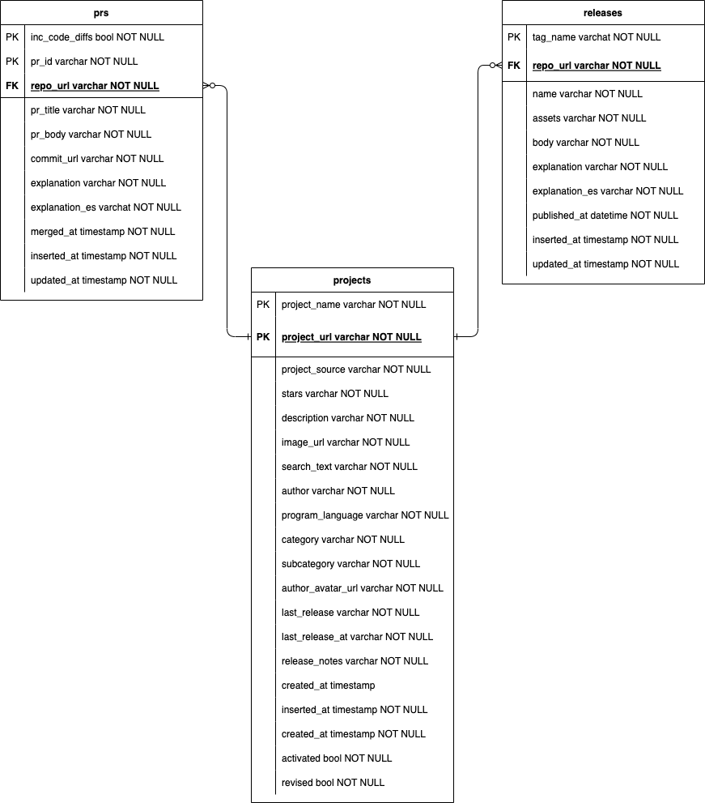
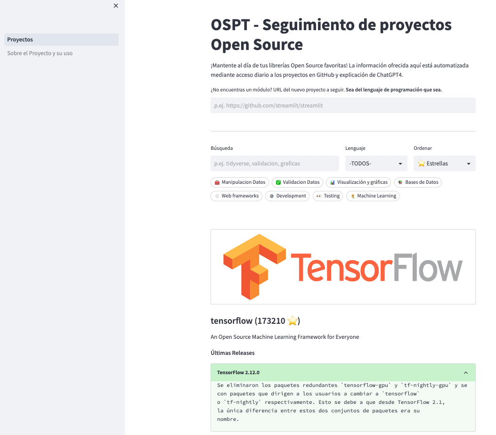

# 🔎 OSPT - Open Source Project Tracker


---- 
[Access to the deployed app in Streamlit Cloud](https://carlosvecina-the-project-tracker-st-appproyectos-mv7k8w.streamlit.app/)

---- 

<br>

## ⛩ Object Structure and Data Model


In this repository, we can find two modules:

- the_project_tracker, the module for data acquisition and summarization by an LLM.
- st_app, the module that contains the Streamlit application.

The fundamental elements of this project are:

- Pipeline: It is the main program, responsible for executing from start to finish the data collection from Github, parsing them, summarizing through AI, and inserting them into a database.
- Retriever: It is responsible for gathering information about Projects, Releases, and PRs. Currently, GitHubRetriever has been implemented, which is in charge of collecting this data through the GitHub API.
- Explainer: It is responsible for calling the NLP model capable of summarizing the content. Currently, OpenAIExplainer has been implemented, which is responsible for making calls to the OpenAI API so that ChatGPT3.5 can summarize and translate entities. It uses titles, bodies, and code differences of the Releases and PRs.
- DataConnection: It is in charge of retrieving data and inserting it into the database. Mainly PGDataConnection is used, although SQLiteDataConnection has also been implemented for educational/debug purposes.
- Streamlit App: It is a separate module responsible for offering an App where the data is made available in a user-friendly manner.

The entities they work with, and which are generally known, are:

- Project
- Release
- PR

<p align="center">
  
</p>

<br>

**Demo**

<p align="center">
  
</p>

<br>

## 🎬 Reproducibility

The dockerization of the service is on the roadmap but not prioritized for now.

This projects makes use [Poetry](https://python-poetry.org/docs/) as a dependency manager. You can easily get it.

```bash
curl -sSL https://install.python-poetry.org | python3 -
```

Required env vars:
```bash
# For  GH Retriever and OpenAI Explainer
GITHUB_TOKEN
OPENAI_TOKEN

# For BBDD we have otions
# 1: local SQLite
LOCAL_DB

# 2: deployed PG
PG_HOST
PG_PORT
PG_DATABASE
PG_USERNAME
PG_PWD
```

Currently, you might not want to run this project locally but rather consume it from the Streamlit app. Publishing this repository serves more educational purposes. This is because both the Streamlit application and the database are deployed and accessible to users.

To execute the Releases and PRs track:
```bash
make track_releases
make track_prs
```

These commands will run the scripts located in src/.

The Project tracking program is prepared to work with Postgres. The Streamlit application is parameterized to accept both this and a local SQLite, although all the development has been done with a deployed PG, configuring the credentials in environment variables as explained a few lines above.

If you wanted to run with a local database, these would be the steps:

```bash
make run_app_local_db
```
To populate the tables, some modification will be necessary, for now, to use the SQLiteDataConnection. In a matter of days/weeks, this behavior will be parameterized to be able to launch the Releases and PRs tracker with a local database.

Acknowledgments for the inspiration in the design of the Streamlit main page to https://github.com/jrieke/components-hub, a project in which I will be more than happy to propose/suggest some improvements that, in my opinion, have been implemented in this one.